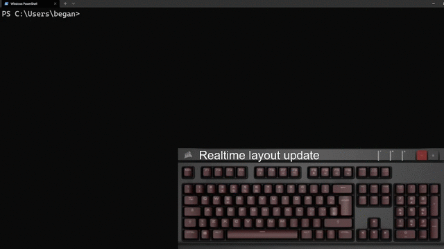

# Vim-iCUE
[](https://discord.gg/ZA76nJ3RsU)
<p align="center">
  
</p>

Vim-iCUE is a Neovim plugin that links together your [Corsair](https://www.corsair.com/) RGB keyboard with
[Neovim](https://neovim.io/)! Make your Neovim experience even better with keyboard RGB themes that change 
automatically as you pass from **Insert** to **Normal** to **Command** mode.

## WARNING!
At the moment, I'm testing Vim-iCUE on my own keyboard which is a [Corsair Strafe](https://www.corsair.com/eu/en/Categories/Products/Gaming-Keyboards/Standard-Gaming-Keyboards/STRAFE-Mechanical-Gaming-Keyboard-%E2%80%94-CHERRY%C2%AE-MX-Silent/p/CH-9104023-NA) and only supports red color.

Vim-iCUE is only tested on Windows 10. It should work with any Windows or MacOS version that supports iCUE, but I'm not sure about that. Let me know if it works 
visiting me on the official [NDD Discord server](https://discord.gg/ZA76nJ3RsU).

Unfortunatly, it will not work on Linux, as iCUE is still not supported yet.

## DISCLAIMER!
This IS NOT an OFFICIAL Corsair project. I'm not responsible for any damage to your Corsair device as this code comes with no warranty.

## DEMO


# Installation
## Requirements
  * [iCUE](https://www.corsair.com/downloads)
  * [Neovim](https://neovim.io/)
  * Python >= 3.10 (maybe 3.7 is enough) 
  * A Corsair keyboard

## Plugging-in

Using Vim-plug:
```init.vim
call plug#begin()
" ... other plugins, if any
Plug 'begbaj/vim-icue'
" .. other plugins, if any
call plug#end()
```

Now you're ready to go! Vim-iCUE will automatically start after installation is complete.

# Themes
By default, Vim-iCUE uses the *begbaj-default-red* theme. To change theme just edit your **init.vim** as follows:
```init.vim
let g:vimicue_theme_name = '<theme-name>'
```
To use a theme you either need to create one or download one.

## Create a new theme

* Windows users: open `~/AppData/Local/nvim/plugged/vim-icue/themes` and create a json file named as your theme.

* MacOS users: open `~/.vim/plugged/vim-icue/themes` and create a json file named as your theme.

## How to write a theme

You have to define the behavior of each single key's LED. All the other keys will take
on the color defined by the 'default' keyname.

Here's an example of a theme:

*example.json*:
```json
{
  "normal":{
      "K_Escape": [255,255,255],
      "default": [255,0,0]
   },
   "insert":
   {
      "K_I": [0,0,255]
   }
   "default":{
      "K_Escape": [255,0,0]
      "default":[255,255,255]
   }
}
```
*behavior*:
1. **normal** mode: `Esc` will be white and all other keys will be red.
2. **insert** mode: `Esc` will be red, `I` will be blue and all other keys will be white.
3. Other modes: `Esc` will be red and all other keys will be white.

## Entries

Each entry should be in this format:

RGB entries:
```
{"keyname" : [R, G, B]}
```

Non-RGB entries:
```
{"keyname": [0,Brightness]}
```

Where:
* Keyname is a String value that identifies the key. 
* \[R,G,B\] and \[0, Brightness\] are lists of 3 and 2 integer values from 0 to 255.

Keyname examples:
```
Keyname for H: K_H
Keyname for J: K_J
Keyname for K: K_K
Keyname for L: K_L
and so on...
```

Here is a [List](Keys.md) of all Keyname values.

## Modes
Neovim provides a ton of different modes, and each mode is usually identified by a char sequence:
```json
{
  "c"  : "command",
  "i"  : "insert",
  "ic" : "insert_compl",
  "ix" : "insert_compl",
  "multi" : "multi",
  "n"  : "normal",
  "ni" : "insert",
  "no" : "op_pending",
  "R"  : "replace",
  "Rv" : "v_replace",
  "s"  : "select",
  "S"  : "s_line",
  "t"  : "terminal",
  "v"  : "visual",
  "V"  : "v_line"
}
```
> Note: Map is inspired to vim-airline
Dictonary values correspond to available theme modes.
# References
* [CUE SDK Docs](https://corsairofficial.github.io/cue-sdk/#single-color-devices)
# TODO:
- [X] Faster layout update
- [ ] Keyname grouping (like: *numbers*, *letters*, ...)
- [ ] Command tree integration
- [ ] Keyboard effects
- [ ] Mouse support

